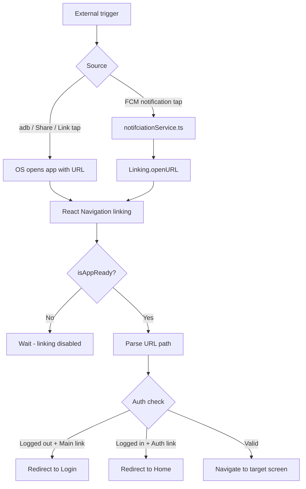

# Deep Linking Implementation Guide

This document describes the step-by-step deep linking setup in **mypractice** using a custom URL scheme (`deeplink://`) with React Navigation, auth-aware routing, share functionality, and Firebase push notification support.

---

## Table of Contents

1. [Overview](#1-overview)
2. [Architecture](#2-architecture)
3. [Step 1 — Native Configuration](#3-step-1--native-configuration)
4. [Step 2 — Navigation Types](#4-step-2--navigation-types)
5. [Step 3 — Linking Config](#5-step-3--linking-config)
6. [Step 4 — Navigation Ref](#6-step-4--navigation-ref)
7. [Step 5 — Routes with Auth Guards](#7-step-5--routes-with-auth-guards)
8. [Step 6 — App Bootstrap (Cold Start)](#8-step-6--app-bootstrap-cold-start)
9. [Step 7 — Share Deep Links](#9-step-7--share-deep-links)
10. [Step 8 — Firebase Push Notification Deep Links](#10-step-8--firebase-push-notification-deep-links)
11. [Supported URLs](#11-supported-urls)
12. [Testing](#12-testing)
13. [Troubleshooting](#13-troubleshooting)
14. [Deep Link vs Universal Link](#14-deep-link-vs-universal-link)

---

## 1. Overview

Deep links allow external sources (another app, browser link, push notification, share sheet) to open the app and navigate directly to a specific screen.

This project uses:

| Layer | Technology |
|-------|------------|
| URL scheme | `deeplink://` |
| Universal / App Links | `https://mypractice.ai/...` — see [UNIVERSAL_LINKS.md](./UNIVERSAL_LINKS.md) |
| JS routing | React Navigation `linking` config |
| Auth handling | Redux `isFirstTime` + custom `getStateFromPath` |
| Share | React Native `Share` API |
| Push taps | Firebase Messaging → `Linking.openURL()` |

**No extra npm packages** are required beyond what is already in the project (`@react-navigation/native`, `@react-native-firebase/messaging`).

---

## 2. Architecture



**File structure:**

```
src/
├── navigation/
│   ├── linking.ts          # URL → screen mapping + URL builder
│   ├── navigationRef.ts    # Imperative navigation ref
│   ├── Routes.tsx          # NavigationContainer + auth guards
│   └── types.ts            # Stack param lists
├── utils/
│   └── shareDeepLink.ts    # Native share sheet helper
├── helper/
│   └── notifciationService.ts  # FCM deep link on notification tap
android/app/src/main/AndroidManifest.xml  # Android intent filter
ios/rn_boilerplate/Info.plist               # iOS URL scheme
```

---

## 3. Step 1 — Native Configuration

The OS must know that URLs starting with `deeplink://` belong to your app.

### Android — `android/app/src/main/AndroidManifest.xml`

Add an `intent-filter` inside `MainActivity`:

```xml
<intent-filter>
  <action android:name="android.intent.action.VIEW" />
  <category android:name="android.intent.category.DEFAULT" />
  <category android:name="android.intent.category.BROWSABLE" />
  <data android:scheme="deeplink" />
</intent-filter>
```

Key points:
- `android:launchMode="singleTask"` on the activity (already set) ensures one app instance handles incoming links.
- `applicationId` is `com.mypractice.ai`.

### iOS — `ios/rn_boilerplate/Info.plist`

Register the custom URL scheme:

```xml
<key>CFBundleURLTypes</key>
<array>
  <dict>
    <key>CFBundleTypeRole</key>
    <string>Editor</string>
    <key>CFBundleURLName</key>
    <string>deeplink</string>
    <key>CFBundleURLSchemes</key>
    <array>
      <string>deeplink</string>
    </array>
  </dict>
</array>
```

After changing native config, rebuild the app (`yarn android` / `yarn ios`).

---

## 4. Step 2 — Navigation Types

Define your navigator structure in `src/navigation/types.ts`. Deep link paths must mirror these screen names.

```typescript
export type RootStackParamList = {
  Auth: undefined;
  Main: undefined;
};

export type AuthStackParamList = {
  Login: undefined;
  Signup: undefined;
  Onboarding: undefined;
  OTPVerification: {
    phoneNumber: string;
  };
};

export type MainStackParamList = {
  Home: undefined;
  Profile: undefined;
  Settings: undefined;
};
```

Navigation hierarchy:

```
Root Stack
├── Auth Stack
│   ├── Login
│   ├── Signup
│   └── OTPVerification (param: phoneNumber)
└── Main Stack (Bottom Tabs)
    ├── Home
    ├── Profile
    └── Settings
```

---

## 5. Step 3 — Linking Config

Create `src/navigation/linking.ts`. This file maps URL paths to screens and provides helpers to build URLs.

```typescript
import { LinkingOptions } from '@react-navigation/native';
import { RootStackParamList } from './types';

export const DEEP_LINK_PREFIX = 'deeplink://';

export const DeepLinkPaths = {
  HOME: 'home',
  PROFILE: 'profile',
  SETTINGS: 'settings',
  LOGIN: 'login',
  SIGNUP: 'signup',
} as const;

export type DeepLinkPath = (typeof DeepLinkPaths)[keyof typeof DeepLinkPaths];

export function buildDeepLinkUrl(
  path: DeepLinkPath | string,
  params?: { phoneNumber?: string },
): string {
  if (path === 'otp' && params?.phoneNumber) {
    return `${DEEP_LINK_PREFIX}otp/${encodeURIComponent(params.phoneNumber)}`;
  }

  return `${DEEP_LINK_PREFIX}${path.replace(/^\//, '')}`;
}

export const linking: LinkingOptions<RootStackParamList> = {
  prefixes: [DEEP_LINK_PREFIX],
  config: {
    screens: {
      Main: {
        screens: {
          Home: 'home',
          Profile: 'profile',
          Settings: 'settings',
        },
      },
      Auth: {
        screens: {
          Login: 'login',
          Signup: 'signup',
          OTPVerification: {
            path: 'otp/:phoneNumber',
            parse: {
              phoneNumber: (value: string) => decodeURIComponent(value),
            },
          },
        },
      },
    },
  },
};
```

**Usage examples:**

```typescript
buildDeepLinkUrl('signup');                        // deeplink://signup
buildDeepLinkUrl('home');                          // deeplink://home
buildDeepLinkUrl('otp', { phoneNumber: '9876543210' }); // deeplink://otp/9876543210
```

---

## 6. Step 4 — Navigation Ref

Create `src/navigation/navigationRef.ts` for imperative navigation outside React components (optional but useful):

```typescript
import { createNavigationContainerRef } from '@react-navigation/native';
import { RootStackParamList } from './types';

export const navigationRef = createNavigationContainerRef<RootStackParamList>();

export function navigate(name: keyof RootStackParamList, params?: object) {
  if (navigationRef.isReady()) {
    navigationRef.navigate(name as never, params as never);
  }
}
```

Attach the ref to `NavigationContainer` in `Routes.tsx` (see Step 5).

---

## 7. Step 5 — Routes with Auth Guards

Update `src/navigation/Routes.tsx` to:

1. Pass the `linking` config to `NavigationContainer`
2. Mount **both** Auth and Main stacks (required for deep links to resolve)
3. Guard links based on login state (`isFirstTime` in Redux)
4. Disable linking until the app has loaded persisted auth state

```typescript
import React, { useMemo } from 'react';
import {
  NavigationContainer,
  getStateFromPath as defaultGetStateFromPath,
} from '@react-navigation/native';
import { createNativeStackNavigator } from '@react-navigation/native-stack';
import { RootStackParamList } from './types';
import AuthStack from './AuthStack';
import { MainStack } from './MainStack';
import { useSelector } from 'react-redux';
import { RootState } from '@/redux/store';
import { linking } from './linking';
import { navigationRef } from './navigationRef';

const Stack = createNativeStackNavigator<RootStackParamList>();

type RoutesProps = {
  isAppReady: boolean;
};

export const Routes = ({ isAppReady }: RoutesProps) => {
  const { isFirstTime } = useSelector((state: RootState) => state.auth);

  const deepLinking = useMemo(
    () => ({
      ...linking,
      enabled: isAppReady,
      getStateFromPath(path: string, options?: Parameters<typeof defaultGetStateFromPath>[1]) {
        const state = defaultGetStateFromPath(path, options);

        if (!state) {
          return state;
        }

        const routeNames = state.routes.map((route) => route.name);
        const wantsMain = routeNames.includes('Main');
        const wantsAuth = routeNames.includes('Auth');

        // Logged out user trying to open a Main screen → redirect to Login
        if (!isFirstTime && wantsMain) {
          return defaultGetStateFromPath('login', options);
        }

        // Logged in user trying to open an Auth screen → redirect to Home
        if (isFirstTime && wantsAuth) {
          return defaultGetStateFromPath('home', options);
        }

        return state;
      },
    }),
    [isAppReady, isFirstTime],
  );

  return (
    <NavigationContainer ref={navigationRef} linking={deepLinking}>
      <Stack.Navigator
        screenOptions={{ headerShown: false }}
        initialRouteName={isFirstTime ? 'Main' : 'Auth'}
        id={undefined}
      >
        <Stack.Screen name="Main" component={MainStack} />
        <Stack.Screen name="Auth" component={AuthStack} />
      </Stack.Navigator>
    </NavigationContainer>
  );
};

export default Routes;
```

### Auth guard behavior

| User state | Incoming link | Result |
|------------|---------------|--------|
| Logged out | `deeplink://profile` | Redirects to **Login** |
| Logged out | `deeplink://signup` | Opens **Signup** |
| Logged in | `deeplink://signup` | Redirects to **Home** |
| Logged in | `deeplink://settings` | Opens **Settings** |

> **Note:** `isFirstTime === true` means the user is logged in (persisted via `IS_FIRST_TIME` in secure storage).

---

## 8. Step 6 — App Bootstrap (Cold Start)

On cold start, auth state is loaded asynchronously from secure storage. Deep links must wait until that finishes, otherwise the wrong stack may be shown.

Update `App.tsx`:

```typescript
import React, { useLayoutEffect, useState } from 'react';
import Routes from '@/navigation/Routes';
import { getLocalItem } from '@/utils/checkStorage';
import { requestUserPermission, setupNotificationDeepLinks } from '@/helper/notifciationService';

const App = () => {
  const [isAppReady, setIsAppReady] = useState(false);

  useLayoutEffect(() => {
    const init = async () => {
      await getLocalItem();           // loads isFirstTime into Redux
      await requestUserPermission();
      setIsAppReady(true);            // enable deep link handling
    };

    init();
  }, []);

  useLayoutEffect(() => {
    if (!isAppReady) {
      return;
    }

    return setupNotificationDeepLinks();
  }, [isAppReady]);

  return (
    // ...providers
    <Routes isAppReady={isAppReady} />
  );
};
```

Flow:
1. App launches → `isAppReady = false` → linking disabled
2. `getLocalItem()` reads auth from secure storage → updates Redux
3. `isAppReady = true` → linking enabled → pending deep link is processed

---

## 9. Step 7 — Share Deep Links

### Utility — `src/utils/shareDeepLink.ts`

```typescript
import { buildDeepLinkUrl, DeepLinkPath } from '@/navigation/linking';
import { Platform, Share } from 'react-native';

type ShareDeepLinkOptions = {
  title?: string;
  message?: string;
};

export async function shareDeepLink(
  path: DeepLinkPath | string,
  options?: ShareDeepLinkOptions,
) {
  const url = buildDeepLinkUrl(path);
  const message = options?.message ?? `Join me on mypractice! ${url}`;

  await Share.share(
    Platform.select({
      ios: {
        title: options?.title ?? 'mypractice',
        message,
        url,
      },
      default: {
        title: options?.title ?? 'mypractice',
        message,
      },
    })!,
  );
}
```

### Usage in Signup screen

```typescript
import { DeepLinkPaths } from '@/navigation/linking';
import { shareDeepLink } from '@/utils/shareDeepLink';

const handleShareSignup = () => {
  shareDeepLink(DeepLinkPaths.SIGNUP);
};

<ButtonComp
  title="SHARE_SIGNUP_LINK"
  onPress={handleShareSignup}
  variant="secondary"
/>
```

### Usage in Settings screen

```typescript
const handleShareApp = () => {
  shareDeepLink(DeepLinkPaths.HOME);
};

const handleShareSignup = () => {
  shareDeepLink(DeepLinkPaths.SIGNUP);
};
```

### Share from any screen

```typescript
import { shareDeepLink } from '@/utils/shareDeepLink';
import { DeepLinkPaths } from '@/navigation/linking';

// Default message
await shareDeepLink(DeepLinkPaths.PROFILE);

// Custom message
await shareDeepLink(DeepLinkPaths.SIGNUP, {
  title: 'Join mypractice',
  message: 'Create your account here!',
});
```

---

## 10. Step 8 — Firebase Push Notification Deep Links

When a user taps a push notification, open a deep link via `Linking.openURL`. React Navigation's linking config handles the rest.

Add to `src/helper/notifciationService.ts`:

```typescript
import { Linking } from 'react-native';
import { FirebaseMessagingTypes, getMessaging } from '@react-native-firebase/messaging';

const openDeepLinkFromNotification = (
  remoteMessage: FirebaseMessagingTypes.RemoteMessage | null,
) => {
  const url = remoteMessage?.data?.deeplink;

  if (typeof url === 'string' && url.length > 0) {
    Linking.openURL(url);
  }
};

export function setupNotificationDeepLinks() {
  // App opened from quit state via notification tap
  getMessaging()
    .getInitialNotification()
    .then(openDeepLinkFromNotification);

  // App in background, user taps notification
  const unsubscribe = getMessaging().onNotificationOpenedApp(
    openDeepLinkFromNotification,
  );

  return unsubscribe;
}
```

### FCM payload format

Send the deep link in the `data` payload (not `notification` body):

```json
{
  "data": {
    "deeplink": "deeplink://profile"
  }
}
```

Supported values: any URL matching the paths in [Supported URLs](#11-supported-urls).

---

## 11. Supported URLs

| URL | Screen | Auth required |
|-----|--------|---------------|
| `deeplink://home` | Main → Home | Yes |
| `deeplink://profile` | Main → Profile | Yes |
| `deeplink://settings` | Main → Settings | Yes |
| `deeplink://login` | Auth → Login | No |
| `deeplink://signup` | Auth → Signup | No |
| `deeplink://otp/9876543210` | Auth → OTPVerification | No |

---

## 12. Testing

### Android (emulator / device)

```bash
# Open Home
adb shell am start -W -a android.intent.action.VIEW -d "deeplink://home" com.mypractice.ai

# Open Signup
adb shell am start -W -a android.intent.action.VIEW -d "deeplink://signup" com.mypractice.ai

# Open Profile
adb shell am start -W -a android.intent.action.VIEW -d "deeplink://profile" com.mypractice.ai

# Open OTP screen
adb shell am start -W -a android.intent.action.VIEW -d "deeplink://otp/9876543210" com.mypractice.ai
```

### Android Intent URL (works better in Chrome)

```
intent://signup#Intent;scheme=deeplink;package=com.mypractice.ai;end
```

### iOS (simulator)

```bash
xcrun simctl openurl booted "deeplink://signup"
xcrun simctl openurl booted "deeplink://profile"
```

### In-app share

1. Open **Signup** or **Settings**
2. Tap **Share Signup Link**
3. Send to Notes/Messages and tap the link

### Test scenarios checklist

- [ ] Cold start (app killed) → deep link opens correct screen
- [ ] Background → deep link switches screen
- [ ] Foreground → deep link navigates in place
- [ ] Logged out + `deeplink://profile` → redirects to Login
- [ ] Logged in + `deeplink://signup` → redirects to Home
- [ ] Share sheet produces a working link

### Clear app data (reset auth for testing)

```bash
adb shell pm clear com.mypractice.ai
```

---

## 13. Troubleshooting

### Link does nothing

- Rebuild the native app after changing `AndroidManifest.xml` or `Info.plist`
- Confirm the URL starts with `deeplink://` (matches `DEEP_LINK_PREFIX`)
- Check that `isAppReady` is `true` before testing cold-start links

### Wrong screen opens

- Verify the path in `linking.ts` matches the URL (e.g. `signup` not `sign-up`)
- Check Redux auth state — auth guards may redirect the link

### Pasting in Chrome address bar does not work

Custom schemes (`deeplink://`) are often blocked when pasted directly in the browser address bar. Use:
- `adb` commands
- Intent URLs (Android)
- Tappable links in Notes/Messages
- In-app share sheet

### Signup link opens Home instead of Signup

User is logged in. Auth guard redirects Auth links to Home. Clear app data or log out first.

---

## 14. Deep Link vs Universal Link

| | Custom scheme (this project) | Universal / App Links |
|---|---|---|
| URL format | `deeplink://signup` | `https://mypractice.com/signup` |
| Works in browser address bar | Unreliable | Yes |
| Fallback if app not installed | None | Opens website |
| Domain verification | Not required | Required |
| Best for | Dev, in-app share, push | Marketing, email, web |

**Universal Links are implemented.** See [UNIVERSAL_LINKS.md](./UNIVERSAL_LINKS.md) for domain hosting and verification. Share and `buildDeepLinkUrl()` default to `https://mypractice.ai/...` URLs.

---

## Adding a New Deep Link Route

1. Add the screen to the appropriate stack (`AuthStack` or `MainStack`)
2. Add the type to `src/navigation/types.ts`
3. Add the path mapping in `src/navigation/linking.ts`:
   ```typescript
   // Example: new screen "About" under Main
   About: 'about',
   ```
4. Add a constant to `DeepLinkPaths` if needed:
   ```typescript
   ABOUT: 'about',
   ```
5. Rebuild if native config changed (not needed for JS-only changes)
6. Test:
   ```bash
   adb shell am start -W -a android.intent.action.VIEW -d "deeplink://about" com.mypractice.ai
   ```
